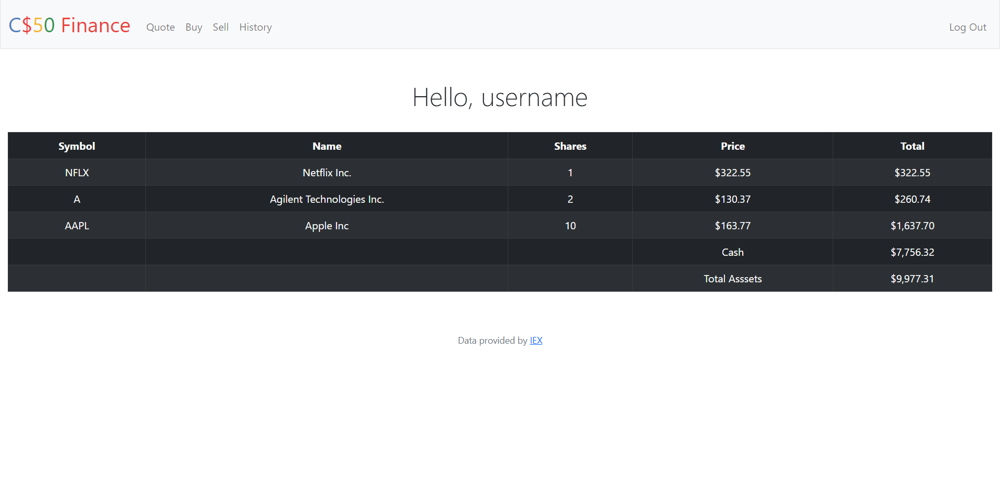

# Harvard's CS50 - Finance

I am pleased to present a challenging and engaging project that I recently completed as part of the Harvard University CS50 course. This website required the use of HTML, CSS, Python, Flask, SQL, and Bootstrap to create a sophisticated platform that allows new users to register and existing users to log in and trade stocks.

By integrating the website with the IEXCLOUD database, users can view and purchase stocks in real-time. Starting with a default balance of $10,000, users can test their trading strategies and attempt to increase their wealth through a stock trading simulator.

To facilitate data collection, SQL was used to record users' transaction history, enabling them to view previous stock purchases and sales, including the price at the time of each transaction and the number of shares traded.

Overall, this project was a valuable learning experience that taught me a great deal about web development and the integration of multiple technologies to create a practical and functional platform.

<a href="https://finance-wtp3.onrender.com/">Click here to see the website</a>

